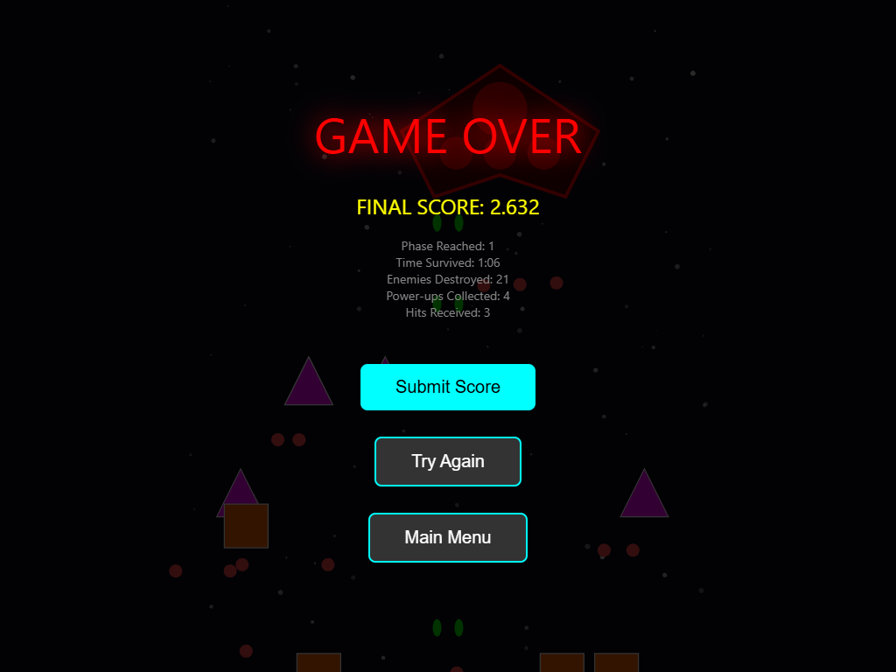

# SPACE SHOOTER - Bullet Hell (1944-like)

Um space shooter 2D vertical scrolling bullet-hell inspirado em *1944: The Loop Master (Capcom)*, com 3 fases, chefes massivos, múltiplos tipos de inimigos, power-ups, leaderboard online e WebSockets em tempo real.



## 🎮 Como Rodar

### Pré-requisitos
- Node.js >= 18.0.0
- npm

### Instalação

```bash
# Clonar o repositório
cd shipshooter

# Instalar dependências
npm install

# Rodar em desenvolvimento (frontend + backend)
npm run dev
```

O jogo estará disponível em:
- **Frontend**: http://localhost:5173
- **Backend API**: http://localhost:3003

### Scripts Disponíveis

| Comando | Descrição |
|---------|-----------|
| `npm run dev` | Roda frontend e backend em desenvolvimento |
| `npm run dev:frontend` | Apenas frontend (Vite) |
| `npm run dev:backend` | Apenas backend (Express) |
| `npm run build` | Build de produção |
| `npm run start` | Inicia servidor de produção |

## 🏗️ Arquitetura

```
shipshooter/
├── frontend/                 # React + TypeScript + Vite
│   ├── src/
│   │   ├── api/             # API client e WebSocket
│   │   ├── engine/          # Motor do jogo (GameEngine, GameCanvas)
│   │   │   ├── GameEngine.ts    # Lógica do jogo
│   │   │   ├── GameCanvas.ts    # Renderização PixiJS
│   │   │   ├── types.ts         # Tipos TypeScript
│   │   │   └── constants.ts     # Configurações do jogo
│   │   ├── ui/              # Componentes React
│   │   │   ├── screens/     # Telas (Home, Game, Leaderboard, etc)
│   │   │   └── components/  # Componentes (HUD, Overlays)
│   │   └── main.tsx
│   └── package.json
├── backend/                  # Node.js + TypeScript + Express
│   ├── src/
│   │   ├── routes/          # API routes
│   │   │   ├── auth.ts      # Autenticação
│   │   │   ├── runs.ts      # Submissão de runs
│   │   │   └── leaderboard.ts # Leaderboard
│   │   ├── socket/          # WebSocket handlers
│   │   ├── utils/           # Helpers (crypto, file I/O)
│   │   └── index.ts
│   └── package.json
├── data/                     # Persistência em arquivos
│   ├── users.json           # Usuários registrados
│   ├── runs.jsonl           # Histórico de runs (JSONL)
│   └── leaderboards.json    # Cache (opcional)
└── package.json             # Workspace root
```

## 🎯 Gameplay

### Controles
| Tecla | Ação |
|-------|------|
| W / ↑ | Mover para cima |
| S / ↓ | Mover para baixo |
| A / ← | Mover para esquerda |
| D / → | Mover para direita |
| Space | Usar Bomba (limpa projéteis + dano em área) |
| P | Pausar |

### Mecânicas

- **Tiro Automático**: A nave atira continuamente
- **Hitbox Pequena**: Bullet hell padrão - hitbox menor que o sprite
- **Invulnerabilidade**: 2 segundos após receber dano
- **Power-ups**: Drops de inimigos com 15% de chance

### Armas (Upgrades via Power-up)

| Nível | Descrição |
|-------|-----------|
| 1 | Tiro frontal único |
| 2 | Tiro duplo |
| 3 | Spread (3 projéteis) |
| 4 | Laser lateral + frontal (5 projéteis) |

### Power-ups

| Tipo | Efeito | Cor |
|------|--------|-----|
| 🔫 Weapon | Upgrade de arma | Verde |
| 🛡️ Shield | Invulnerabilidade 5s | Azul |
| 💣 Bomb | +1 Bomba | Laranja |
| ❤️ Heal | +1 HP | Rosa |
| ⭐ Score | +1000 pontos | Amarelo |

## 👾 Inimigos

### Tipos

| Tipo | Nome | Comportamento | Padrão de Tiro |
|------|------|---------------|----------------|
| A | Drone | Movimento reto, velocidade média | Tiro único frontal |
| B | Zigzag | Movimento senoidal | Tiros diagonais |
| C | Tank | Lento, HP alto | Rajada frontal (3 tiros) |
| D | Turret | Quase estático | Padrão radial (8 tiros) |
| E | Kamikaze | Persegue o player | Não atira, explode no contato |

### Fases

| Fase | Inimigos | Chefe | HP do Chefe |
|------|----------|-------|-------------|
| 1 | A, B | CRUISER | 500 |
| 2 | A, B, C, D | FORTRESS | 1200 |
| 3 | A, B, C, D, E | DREADNOUGHT | 3000 |

### Chefes

Cada chefe tem **3 fases** baseadas em HP:
- **Fase 1** (>66% HP): Tiros aimed
- **Fase 2** (33-66% HP): Padrão espiral
- **Fase 3** (<33% HP): Radial + Wave (bullet hell intenso)

## 📡 API Endpoints

### Autenticação

```
POST /api/auth/register
Body: { username: string, password: string }
Response: { token: string, user: User }

POST /api/auth/login
Body: { username: string, password: string }
Response: { token: string, user: User }
```

### Runs

```
POST /api/runs
Headers: Authorization: Bearer <token>
Body: {
  score: number,
  phase: number,
  time: number,
  powerupsCollected: number,
  hitsReceived: number,
  enemiesDestroyed: number,
  bossDamageDealt: number
}
Response: { runId: string, score: number }

GET /api/runs/me
Headers: Authorization: Bearer <token>
Response: Run[]
```

### Leaderboard

```
GET /api/leaderboard
Query: ?phase=1|2|3 (opcional)
Response: Run[] (top 20)

GET /api/health
Response: { status: 'ok', timestamp: string }
```

## 🔌 WebSocket Events

### Cliente → Servidor

| Event | Dados | Descrição |
|-------|-------|-----------|
| `authenticate` | `token: string` | Autentica conexão |
| `request_leaderboard` | `phase?: number` | Solicita leaderboard |

### Servidor → Cliente

| Event | Dados | Descrição |
|-------|-------|-----------|
| `authenticated` | - | Confirmação de auth |
| `auth_error` | `{ error: string }` | Erro de autenticação |
| `leaderboard:update` | `Run[]` | Leaderboard atualizado |

## 💾 Persistência

### Formato dos Arquivos

**users.json**
```json
[
  {
    "id": "uuid",
    "username": "player1",
    "passwordHash": "salt:hash",
    "createdAt": "2024-01-01T00:00:00.000Z"
  }
]
```

**runs.jsonl** (JSONL - uma linha por run)
```json
{"id":"uuid","userId":"uuid","username":"player1","score":5000,"phase":2,"time":120,"powerupsCollected":8,"hitsReceived":2,"enemiesDestroyed":45,"bossDamageDealt":500,"createdAt":"2024-01-01T00:00:00.000Z"}
```

## ✅ Validação Playwright

O jogo foi validado via Playwright controlando o browser diretamente:

### Checklist Validado

- ✅ App abre corretamente
- ✅ Backend responde (health check)
- ✅ Registro de usuário funciona
- ✅ Login funciona
- ✅ Redirecionamento para home após login
- ✅ Navegação para tela de jogo
- ✅ Canvas PixiJS renderiza
- ✅ HUD aparece (HP, Score, Phase, Weapon Level, Bombs)
- ✅ Movimento do player (WASD/Arrow keys)
- ✅ Tiro automático funcionando
- ✅ Inimigos spawnam e movem
- ✅ Colisão player-inimigo
- ✅ Colisão projétil-inimigo
- ✅ Inimigos destruídos (21 em primeiro teste)
- ✅ Power-ups coletados (4 em primeiro teste)
- ✅ Boss Warning aparece após 15 inimigos
- ✅ Boss spawn e movimento
- ✅ Boss atira padrões bullet hell
- ✅ Game Over ao perder HP
- ✅ Tela de Game Over mostra estatísticas
- ✅ Submissão de score funciona
- ✅ Leaderboard atualizado após submit
- ✅ WebSocket conectado (log "Connected to server")
- ✅ Dados persistidos em JSONL
- ✅ Leaderboard:live update via WS

### Evidências

- **Screenshot**: `gameplay-8s.png` - Gameplay ativa
- **Dados**: `data/runs.jsonl` - 2 runs registradas
- **Leaderboard**: Tabela ordenada por score

## 🛠️ Stack Técnico

### Frontend
- **React 18** + TypeScript
- **Vite 5** - Build tool
- **PixiJS 8** - Renderização WebGL/Canvas2D
- **react-router-dom** - Roteamento
- **socket.io-client** - WebSocket

### Backend
- **Node.js** + TypeScript
- **Express 4** - HTTP server
- **Socket.IO 4** - WebSocket
- **uuid** - ID generation

### Padrões
- **Singleton**: GameEngine, GameCanvas
- **Object Pool**: BulletPool para projéteis
- **Observer**: Callbacks para eventos do jogo
- **Factory**: Spawn de enemies/powerups

## 📋 TODO / Melhorias Futuras

- [ ] Sound effects e música
- [ ] Mais padrões bullet hell
- [ ] Minibosses
- [ ] Dificuldade dinâmica
- [ ] Conquistas/Achievements
- [ ] Replays
- [ ] Mobile touch controls
- [ ] PWA support

## 📄 Licença

MIT

---

Desenvolvido como projeto de demonstração de um jogo bullet hell completo com backend persistente e validação automatizada.
